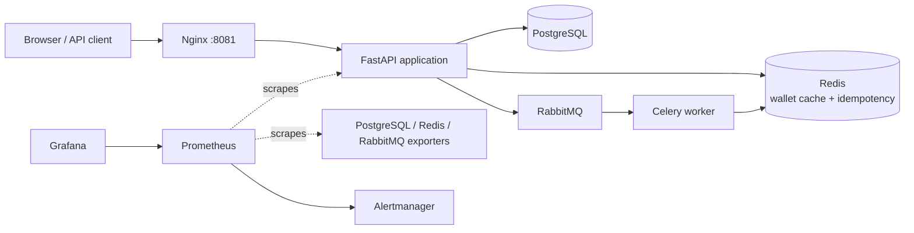

# Transfer System

A production-oriented wallet and money transfer service built with FastAPI,
PostgreSQL, Redis, RabbitMQ, and Celery. The project demonstrates transaction-safe
balance updates, duplicate-request protection, asynchronous processing, structured
logging, metrics, alerting, and container orchestration.

The repository includes a small browser UI, an OpenAPI interface, a complete Docker
Compose environment, and Kubernetes manifests with API and worker autoscaling.

> This is an educational and portfolio project. See
> [Production considerations](#production-considerations) before treating it as a
> real financial system.

## Table of contents

- [Features](#features)
- [Architecture](#architecture)
- [Technology stack](#technology-stack)
- [Quick start](#quick-start)
- [API usage](#api-usage)
- [How a transfer is processed](#how-a-transfer-is-processed)
- [Reliability and consistency](#reliability-and-consistency)
- [Configuration](#configuration)
- [Observability](#observability)
- [Development and testing](#development-and-testing)
- [Load testing](#load-testing)
- [Kubernetes](#kubernetes)
- [Project structure](#project-structure)
- [Production considerations](#production-considerations)

## Features

- User creation with one automatically created wallet and an initial balance of
  `100.00` units.
- Atomic wallet-to-wallet transfers using a single database transaction and
  PostgreSQL row-level locks.
- Validation for missing wallets, non-positive amounts, self-transfers, and
  insufficient funds.
- Redis-backed wallet read cache with a 60-second TTL and post-transfer
  invalidation.
- Required `Idempotency-Key` protection for transfer requests with a 24-hour Redis
  reservation.
- Asynchronous transfer notifications through RabbitMQ and Celery with automatic
  retry and exponential backoff.
- Nginx reverse proxy with gzip, request buffering, timeouts, and transfer rate
  limiting.
- Prometheus metrics, a provisioned Grafana dashboard, Alertmanager rules, and
  PostgreSQL/Redis/RabbitMQ exporters.
- JSON logs and request correlation through `X-Request-ID` across the API and
  Celery worker.
- Optional Sentry error and performance monitoring with sensitive-value filtering.
- Docker Compose for the complete local stack.
- Kubernetes manifests with HPA for the API and KEDA scaling for Celery workers.
- Automated linting, formatting, type checking, tests, security scanning, and image
  builds in GitHub Actions.

## Architecture



The application follows a layered structure:

- **API layer** parses HTTP input and formats responses.
- **Use-case layer** coordinates caching, idempotency, and post-transfer side
  effects.
- **Service layer** implements business rules and transaction-safe database
  operations.
- **Persistence layer** contains SQLAlchemy models, sessions, and transaction
  helpers.
- **Infrastructure layer** integrates Redis, RabbitMQ, Celery, Sentry, metrics,
  containers, and Kubernetes.

## Technology stack

| Area | Technology | Purpose |
| --- | --- | --- |
| API | FastAPI, Uvicorn, Pydantic | HTTP API, validation, OpenAPI documentation |
| Persistence | SQLAlchemy 2, PostgreSQL, Psycopg | Relational data and atomic transfers |
| Cache | Redis | Wallet read cache, idempotency reservations, Celery result backend |
| Messaging | RabbitMQ, Celery | Asynchronous notification processing |
| Edge | Nginx | Reverse proxy, gzip, rate limiting, and timeouts |
| Observability | Prometheus, Grafana, Alertmanager, Sentry | Metrics, dashboards, alerts, traces, and errors |
| Runtime | Docker, Docker Compose, Kubernetes | Reproducible local and clustered deployment |
| Quality | Pytest, Ruff, MyPy, Bandit, pre-commit | Tests and automated code checks |

The application supports Python 3.10 and newer. The Docker image uses Python 3.11.

## Quick start

### Prerequisites

- Docker Engine or Docker Desktop
- Docker Compose v2 (`docker compose`)

### Start the complete stack

The repository contains development defaults in `.env.example`, so no initial
configuration is required:

```bash
docker compose up --build
```

Wait until `transfer_app` becomes healthy, then verify the API:

```bash
curl http://localhost:8081/health
```

Expected response:

```json
{"status":"ok"}
```

### Available services

| Service | URL |
| --- | --- |
| Browser UI | <http://localhost:8081/> |
| Users UI | <http://localhost:8081/ui/users> |
| Wallets UI | <http://localhost:8081/ui/wallets> |
| Transfers UI | <http://localhost:8081/ui/transfers> |
| Swagger UI | <http://localhost:8081/docs> |
| ReDoc | <http://localhost:8081/redoc> |
| Health check | <http://localhost:8081/health> |
| Prometheus metrics | <http://localhost:8081/metrics> |
| RabbitMQ management | <http://localhost:15672/> |
| Prometheus | <http://localhost:9090/> |
| Grafana | <http://localhost:3000/> |
| Alertmanager | <http://localhost:9093/> |

RabbitMQ uses `guest` / `guest` in the default local setup. Grafana uses its image
defaults and prompts for a password change on first login.

Inspect or stop the environment with:

```bash
docker compose ps
docker compose stop
```

Use `docker compose down` to remove the containers. The development PostgreSQL
service does not currently use a named volume, so removing its container also
removes its database data.

### Use a custom environment file

Copy the example and point Compose to the new file.

PowerShell:

```powershell
Copy-Item .env.example .env
$env:ENV_FILE = ".env"
docker compose up --build
```

Bash:

```bash
cp .env.example .env
ENV_FILE=.env docker compose up --build
```

The values in `.env.example` are development credentials. Do not use them in a
shared or production environment.

## API usage

### Endpoints

| Method | Path | Description |
| --- | --- | --- |
| `POST` | `/users` | Create a user and a wallet with a `100.00` initial balance |
| `GET` | `/users/{user_id}` | Get a user together with wallet details |
| `GET` | `/wallets/{wallet_id}` | Get a wallet, using Redis when caching is enabled |
| `POST` | `/transfers` | Transfer funds between wallets |
| `GET` | `/health` | Check API availability |
| `GET` | `/metrics` | Export Prometheus metrics |

Interactive request and response schemas are available in Swagger UI at
<http://localhost:8081/docs>.

### Create two users

```bash
curl -X POST http://localhost:8081/users
curl -X POST http://localhost:8081/users
```

Example first response:

```json
{
  "id": 1,
  "created_at": "2026-07-29T10:00:00+00:00",
  "wallet": {
    "balance": 100.0
  }
}
```

Read each user to obtain the wallet IDs:

```bash
curl http://localhost:8081/users/1
curl http://localhost:8081/users/2
```

Example response:

```json
{
  "id": 1,
  "created_at": "2026-07-29T10:00:00+00:00",
  "wallet": {
    "id": 1,
    "balance": 100.0
  }
}
```

### Create a transfer

`POST /transfers` accepts the transfer data as query parameters and requires an
`Idempotency-Key` header. Use a new unique value, preferably a UUID, for every new
operation.

```bash
curl -X POST \
  "http://localhost:8081/transfers?from_wallet_id=1&to_wallet_id=2&amount=25.00" \
  -H "Idempotency-Key: 7f9864d4-2034-4b5d-9f0e-898609da73fd" \
  -H "X-Request-ID: readme-example-001"
```

Example response:

```json
{
  "id": 1,
  "from_wallet_id": 1,
  "to_wallet_id": 2,
  "amount": 25.0,
  "created_at": "2026-07-29T10:01:00+00:00"
}
```

Check the updated balances:

```bash
curl http://localhost:8081/wallets/1
curl http://localhost:8081/wallets/2
```

On a fresh database, the expected balances are `75.00` and `125.00`.

> On Windows PowerShell, use `curl.exe` for the examples above if `curl` is mapped
> to `Invoke-WebRequest`.

### Error responses

| Status | Typical cause |
| --- | --- |
| `400` | Non-positive amount or transfer to the same wallet |
| `404` | User or wallet does not exist |
| `409` | Insufficient funds or reused idempotency key |
| `422` | Missing or invalid query/header value |
| `500` | Unexpected server error; the response includes a request ID |

## How a transfer is processed

1. Nginx accepts the request and applies the `/transfers` rate limit.
2. FastAPI validates the query parameters and required `Idempotency-Key` header.
3. Redis atomically reserves the idempotency key for 24 hours.
4. The service sorts both wallet IDs and locks both wallet rows with
   `SELECT ... FOR UPDATE` in a stable order.
5. The service validates wallet existence, transfer direction, amount, and source
   balance.
6. The source wallet is debited, the destination wallet is credited, and a
   transaction record is inserted in one database transaction.
7. After commit, both wallet cache entries are invalidated.
8. A notification task is published to RabbitMQ.
9. The Celery worker processes the task and retries transient failures with
   exponential backoff.

Sorting and locking the wallet rows reduces deadlock risk and prevents concurrent
requests from corrupting balances. A failed database operation rolls back the
entire transfer.

## Reliability and consistency

### Atomic balance updates

The debit, credit, and transaction record are committed together. There is no
successful state in which only one wallet has been updated.

### Idempotency behavior

The current implementation uses Redis as a fail-closed reservation store:

- a key is reserved atomically with `SET NX` for 24 hours;
- reusing the same key and payload returns `409 A request is already in progress`;
- reusing the key with different data returns `409 Idempotency-Key reuse with
  different request data`;
- a failed transfer removes its reservation so the operation can be retried;
- an unavailable or disabled idempotency store rejects the transfer to avoid
  accidental duplicate processing.

The service does not currently persist and replay the original HTTP response.

### Wallet caching

`GET /wallets/{wallet_id}` checks Redis before PostgreSQL. Cached wallet data lives
for 60 seconds and is invalidated for both wallets after every successful transfer.
Wallet reads fall back to PostgreSQL if Redis caching fails.

### Notification delivery

The notification is enqueued after the transfer commits. A broker enqueue failure
is logged and does not roll back the financial transaction. Once accepted by
Celery, a failed notification task is retried up to five times with backoff.

### Edge protection

Nginx limits `/transfers` to 20 requests per second per client address with a burst
of 5. It also applies gzip compression and a timeout hierarchy around the API.

## Configuration

The application loads settings through Pydantic Settings. Docker Compose uses
`.env.example` unless `ENV_FILE` points to another file.

| Variable | Default/example | Description |
| --- | --- | --- |
| `ENV_FILE` | `.env.example` in Compose | Selects the environment file |
| `APP_ENV` | `dev` | `local`, `dev`, `test`, `staging`, or `production` |
| `POSTGRES_USER` | `postgres` | PostgreSQL container user |
| `POSTGRES_PASSWORD` | `postgres` | PostgreSQL container password |
| `POSTGRES_DB` | `transfer_db` | PostgreSQL database name |
| `DATABASE_URL` | required | SQLAlchemy PostgreSQL or SQLite URL |
| `REDIS_URL` | required | Redis URL for cache, idempotency, and Celery results |
| `RABBITMQ_URL` | required | AMQP broker URL; `memory://` is accepted for tests |
| `CACHE_ENABLED` | `false` in code, `true` in Compose | Enables Redis wallet caching and the idempotency client |
| `LOG_LEVEL` | `INFO` | Python log level |
| `NOTIFY_FAIL_RATE` | `0.0` | Probability from `0.0` to `1.0` used to simulate notification failure |
| `NOTIFY_DELAY_SEC` | `2.0` | Artificial notification processing delay |
| `SENTRY_DSN` | empty | Enables Sentry when set |
| `SENTRY_ENVIRONMENT` | `APP_ENV` | Sentry environment name |
| `SENTRY_RELEASE` | empty | Git SHA or deployed image version |
| `SENTRY_TRACES_SAMPLE_RATE` | `0.0` | Trace sample rate from `0.0` to `1.0` |
| `SENTRY_PROFILES_SAMPLE_RATE` | `0.0` | Profile sample rate from `0.0` to `1.0` |
| `SENTRY_EXTRA_SENSITIVE_KEYS` | empty | Additional comma-separated or JSON-array keys to filter |

See [docs/sentry.md](docs/sentry.md) for Sentry configuration and live verification.

## Observability

### Metrics and dashboards

Prometheus scrapes the FastAPI application, PostgreSQL exporter, Redis exporter,
and RabbitMQ Prometheus plugin every five seconds. Grafana automatically provisions
the Prometheus datasource and the **Transfer System Overview** dashboard.

Application metrics include:

- request totals, outcomes, exceptions, and duration histograms;
- successful transfer count and total transferred amount;
- wallet, user, and transaction counts;
- total ledger balance and system metric collection status;
- wallet cache hits and misses;
- database query duration and errors by operation.

Alert rules cover API 5xx rate, p95 latency, RabbitMQ backlog, database query
errors, and failures while collecting system metrics. The local Alertmanager has a
default receiver without an external notification integration.

### Logs and request correlation

The API and worker emit structured JSON logs. Send an optional `X-Request-ID`
header to correlate a request with its transfer and Celery notification logs. If
the header is missing, the API generates an ID and returns it in the response.
Every HTTP response also emits an `http_request_completed` access log with the
request method, path, response status, duration in milliseconds, and request ID.
Error response bodies include the same value in their `request_id` field.

### Sentry

Sentry is disabled when `SENTRY_DSN` is empty. When enabled, the integration
captures FastAPI, Celery, SQLAlchemy, and Redis errors and traces. Authorization,
cookies, passwords, tokens, idempotency keys, and configured custom fields are
filtered before events are sent.

## Development and testing

### Install dependencies

```bash
python -m venv .venv
```

Activate the environment with `source .venv/bin/activate` on Linux/macOS or
`.\.venv\Scripts\Activate.ps1` in PowerShell, then install the dependencies:

```bash
python -m pip install --upgrade pip
python -m pip install -r requirements.txt -r requirements-dev.txt
```

### Run tests

PowerShell:

```powershell
$env:ENV_FILE = ".env.test"
python -m pytest -q
```

Bash:

```bash
ENV_FILE=.env.test python -m pytest -q
```

The test configuration uses in-memory SQLite, disables caching, uses an in-memory
broker, and removes the artificial notification delay.

### Run code-quality checks

```bash
ruff check .
ruff format --check .
mypy app
bandit -r app
```

Install the repository hooks with:

```bash
pre-commit install
pre-commit run --all-files
```

GitHub Actions runs code-quality checks, tests, Bandit, and a Docker image build on
pushes and pull requests.

## Load testing

The repository includes an asynchronous load-test helper. Against Docker Compose,
run:

```bash
python scripts/load_test.py api \
  --base-url http://localhost:8081 \
  --users 20 \
  --requests 500 \
  --concurrency 25 \
  --rps 20
```

The script creates users and wallets, sends transfers with unique idempotency keys,
and prints throughput, status counts, and p50/p95/p99 latency. Keep `--rps` at 20
or below when testing through Nginx, or expect `429 Too Many Requests` responses.

Kubernetes-specific API and worker load scenarios are documented in
[k8s/README.md](k8s/README.md).

## Kubernetes

The `k8s/` directory contains manifests for:

- the namespace, application, worker, Nginx, PostgreSQL, Redis, and RabbitMQ;
- ConfigMap and local secret templates;
- CPU-based API autoscaling through HPA;
- RabbitMQ queue-length worker autoscaling through KEDA;
- API and worker load jobs.

The manifests target local clusters such as `kind` and use a locally loaded
`transfer-system:latest` image. Metrics Server is required for HPA, and KEDA plus
its CRDs are required for worker autoscaling.

Follow the complete deployment and load-testing guide in
[k8s/README.md](k8s/README.md).

## Project structure

```text
transfer-system/
|-- app/
|   |-- api/                 # FastAPI routers
|   |-- core/                # Settings, logging, middleware, metrics, Sentry, Celery
|   |-- db/                  # SQLAlchemy models, sessions, transactions, migrations
|   |-- services/            # Business rules and domain exceptions
|   |-- tasks/               # Celery notification tasks
|   |-- usecases/            # Cache/idempotency and workflow orchestration
|   |-- cache.py             # Redis cache abstraction
|   |-- idempotency.py       # Redis idempotency manager
|   `-- main.py              # Application entry point
|-- static/                  # Browser UI and static assets
|-- tests/                   # API, service, cache, logging, metrics, and Sentry tests
|-- observability/           # Prometheus rules, Grafana provisioning, Alertmanager
|-- nginx/                   # Reverse proxy configuration
|-- k8s/                     # Kubernetes runtime and load-test manifests
|-- scripts/                 # Load testing and Sentry verification
|-- docs/                    # Extended documentation
|-- docker-compose.yml       # Complete local environment
|-- Dockerfile               # API/worker image
|-- prometheus.yml           # Prometheus scrape configuration
|-- pyproject.toml           # Ruff and Pytest configuration
`-- requirements*.txt        # Runtime and development dependencies
```

## Production considerations

Before deploying this project as a real money system, address at least the
following:

- Add authentication, authorization, account ownership, and an audit policy.
- Replace development credentials and Kubernetes secret templates with a managed
  secret store.
- Use TLS for public traffic and encrypted connections to infrastructure services.
- Add a managed migration workflow; the application currently calls
  `Base.metadata.create_all()` during startup.
- Add durable PostgreSQL storage, backups, restore testing, and disaster recovery.
- Decide on a monetary currency model, precision rules, limits, and compliance
  requirements.
- Persist and replay completed idempotent responses if clients require standard
  retry semantics.
- Use a transactional outbox or equivalent mechanism if notification publication
  must be guaranteed after a database commit.
- Configure real Alertmanager receivers and production Sentry sampling rates.
- Pin, scan, and regularly update container images instead of using floating
  `latest` tags for observability services.
